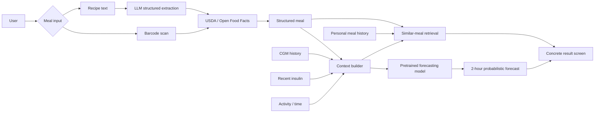

# GlycoLens: Updated Project Summary

## Title

**GlycoLens: AI-Assisted Meal Understanding and Personalized Glucose Response Prediction for Type 1 Diabetes**

## 1. Revised project direction

GlycoLens is a mobile-first AI application intended to help people with Type 1 Diabetes (T1D) understand how a planned or logged meal relates to their glucose behavior. A person with T1D continuously manages interactions among glucose, food, externally administered insulin, physical activity, and individual physiology. Continuous Glucose Monitors (CGMs) provide dense glucose measurements, but food decisions - especially home-cooked meals - still require substantial manual reasoning.

The capstone will **not train a large forecasting model from scratch**. Based on advisor feedback and current research, the project will focus on **model inference and system integration**. Existing pretrained time-series or CGM foundation models will be evaluated on meal-centered T1D forecasting. The technical question is not "Can I invent another glucose model?" but rather:

> **Which pretrained model, with which T1D-specific inference context, provides the best balance of forecasting accuracy, uncertainty quality, latency, implementation cost, and usability for GlycoLens?**

The application is the major deliverable. It will combine meal understanding, nutrition grounding, patient-context construction, pretrained forecasting, personal meal retrieval, and clear visualization.

## 2. User problem

GlycoLens targets four practical questions:

1. **What is in this meal?**
2. **How did similar meals affect me previously?**
3. **Given my current CGM and recent context, what does the model forecast for the next two hours?**
4. **How does the predicted trajectory change if I modify the portion or meal composition?**

GlycoLens will not provide insulin-dose recommendations, change clinician settings, or control a pump.

## 3. Core workflow



## 4. Inference-first ML strategy

The app will expose the forecasting model through a common adapter interface so several pretrained models can be compared without changing the rest of the application.

Required model candidates:

- **Chronos-2** - 120M-parameter zero-shot time-series foundation model; supports multivariate and covariate-informed forecasting and quantile outputs.
- **TimesFM-3** - Google's newest TimesFM release (August 31, 2026); supports native multivariate forecasting and covariates. Its weights are non-commercial/non-production, which is compatible with a student research project but should be documented.
- **CGMformer** - CGM-specific pretrained representation model with a public checkpoint; its published `CGMformer_Diet` formulation is closely aligned with post-meal prediction but requires a downstream trained component.

Reference-only/current research:
- **GlucoFM** - extremely relevant CGM foundation model released in 2026; reports strong postprandial forecasting with frozen representations and progressively added meal/context inputs, but official pretrained weights are not currently public.

Fallback:
- A simple **persistence baseline** is required.
- LightGBM may be retained as a small task-specific baseline or residual calibration model.
- Full LSTM/Transformer training is not a required deliverable.

## 5. Forecasting task

For a meal occurring at time `t`, the application builds an inference context from information available at or before the meal.

Typical context:

- recent CGM sequence
- current glucose and recent trend
- recent bolus/basal insulin when available
- meal energy/macronutrients: carbohydrates, protein, fat, fiber
- meal type/time
- optional activity context

The model forecasts the **complete next two-hour glucose trajectory**. The user-facing UI can summarize the trajectory at 30, 60, and 120 minutes and display model quantiles/uncertainty.

The core retrospective evaluation is simple:

1. Select a historical meal.
2. Hide the next two hours of CGM.
3. Give the model only pre-meal/current context.
4. Forecast.
5. Reveal the true CGM trajectory.
6. Measure error.

## 6. Main experimental question

The core experiment is an **inference-context ablation**, not a training-size competition.

```text
A. CGM only
B. CGM + recent insulin
C. CGM + insulin + carbohydrates
D. CGM + insulin + full meal nutrition
E. D + activity/time context
```

For every model configuration, evaluate:

- MAE / RMSE
- full-trajectory error
- probabilistic metric such as CRPS when quantile samples are available
- 30/60/120-minute errors
- inference latency
- memory/compute footprint
- rate of unusable/failed model runs

The selected application model will be chosen on the **accuracy + reliability + latency + integration** tradeoff, not just lowest RMSE.

## 7. Data strategy

### Primary rich-context dataset: T1D-UOM

T1D-UOM contains three months of real-world data from 17 people with T1D, including CGM, basal/bolus insulin, carbohydrates, protein, fat, fiber, physical activity and sleep. Its small number of participants is a limitation for large model training but is acceptable for **retrospective inference experiments, event-centered evaluation, and context-ablation studies**.

### External/common-feature validation

- **AZT1D:** 25 individuals, 6-8 weeks, CGM, insulin, carbohydrates, AID modes.
- **HUPA-UCM:** 25 individuals, CGM, insulin, carbohydrates, activity, heart rate, sleep.

These datasets do not contain the same full nutritional feature set, so they will be used only with shared feature configurations.

### Supporting benchmark resources

- **GlucoFM-Bench:** standardized CGM-only benchmark data from multiple public cohorts.
- **EventGlucoseBench:** useful event-centered evaluation methodology around meals, medication and exercise.

### Integration/simulation data

- **Dexcom Sandbox:** API/OAuth/integration testing; not formal ML validation.
- **py-mgipsim:** controlled virtual T1D scenarios and demo/stress testing; not real-patient ground truth.

## 8. App-first scope

### Required patient-facing features

1. Mobile-first onboarding/demo mode.
2. Current/recent CGM timeline.
3. Add meal:
   - barcode
   - food search
   - home recipe text
4. Nutrition verification with provenance.
5. Run forecast.
6. Forecast trajectory + uncertainty.
7. Similar historical meals / Meal Passport.
8. What-if portion comparison.
9. Later actual-vs-predicted view when post-meal CGM becomes available.

### Research/admin features

- choose model
- choose context configuration
- run benchmark batch
- compare metrics
- record model/version/config for reproducibility

## 9. Recommended app type

**Mobile-first Progressive Web App (PWA).**

Why:
- one codebase
- deployable quickly
- can run on phones and laptops
- installable to home screen
- avoids App Store / Play Store review
- suitable for capstone demos
- browser camera can support barcode scanning

If native-device integrations become a hard requirement, React Native/Expo remains the fallback.

## 10. Database/personalization decision

Use **PostgreSQL + pgvector**, not GraphRAG for the MVP.

The data is naturally structured: users, CGM samples, meals, insulin events, forecasts and outcomes. Similar-meal personalization can be handled with:

- SQL filters
- numeric feature distance
- semantic embeddings in pgvector
- optional hybrid ranking

GraphRAG would add a graph database, graph construction, graph retrieval and LLM orchestration without a clear benefit to the core forecasting problem. Neo4j AuraDB Free could be explored later, but only as a stretch goal if the main application is complete.

## 11. Expected contribution

GlycoLens is an **applied AI systems capstone**, not a new foundation-model paper.

The contribution is the design and evaluation of an end-to-end system that:

- uses existing pretrained models responsibly
- constructs meaningful T1D context for inference
- compares model/context combinations scientifically
- grounds meal nutrition in authoritative/open data
- personalizes results with a user's own historical evidence
- converts probabilistic model outputs into understandable, concrete app outputs

## Key references

- Amazon Chronos-2 model card: https://huggingface.co/amazon/chronos-2
- Google TimesFM: https://github.com/google-research/timesfm
- Google TimesFM-3 announcement: https://research.google/blog/timesfm-3-a-zero-shot-foundation-model-for-multivariate-forecasting/
- CGMformer: https://github.com/YurunLu/CGMformer
- GlucoFM: https://research.google/blog/glucofm-foundation-model-for-continuous-glucose-monitoring/
- GlucoFM-Bench: https://arxiv.org/abs/2606.06881
- T1D-UOM: https://zenodo.org/records/15806142
