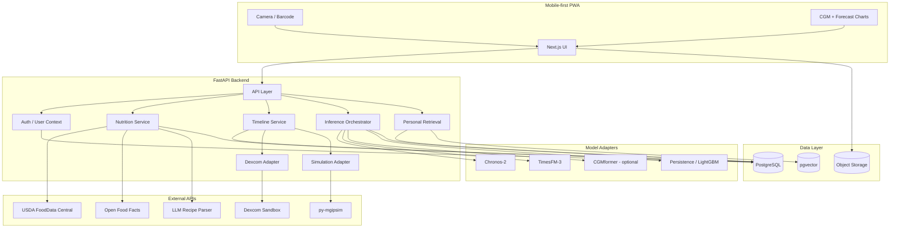

# GlycoLens Tech Stack and System Architecture

## 1. Architecture principle

Use a **modular monolith + separate model adapters**, not microservices.

Reason:
- one student
- short semester
- easier deployment/debugging
- model adapters still make forecasting components replaceable
- avoids distributed-systems overhead that does not contribute to the capstone goal

## 2. Recommended stack

| Layer | Technology | Why |
|---|---|---|
| Client | **Next.js + TypeScript** | Fast web development; PWA support; laptop + mobile |
| UI | Tailwind CSS + component library | Fast consistent UI |
| Charts | Recharts or Plotly | CGM + forecast timelines |
| Barcode | Browser barcode library (ZXing browser layer or equivalent) | Camera-based UPC/EAN capture |
| Backend | **FastAPI + Python** | Natural fit for model inference/data science |
| Validation | Pydantic | Typed API contracts |
| Data processing | Polars/Pandas + NumPy | CGM/event preprocessing |
| App DB | **PostgreSQL via Supabase** | relational data, auth ecosystem, low student cost |
| Vector retrieval | **pgvector** | similar meals in same database |
| File/object storage | Supabase Storage or local research storage | meal images/exports if needed |
| Forecast models | PyTorch/official model libraries | Chronos/TimesFM/CGM adapters |
| Nutrition | USDA FDC + Open Food Facts | structured nutrition |
| CGM integration | Dexcom OAuth 2.0 API | sandbox integration |
| Simulation | py-mgipsim | controlled virtual T1D data |
| Testing | Pytest + Playwright | backend + critical UX flows |
| Packaging | Docker | reproducible backend/model environment |

## 3. Why a PWA instead of native iOS/Android

Next.js now documents a direct PWA path supporting home-screen installation and app-like behavior without separate codebases or app-store approval.

For this capstone:
- the barcode workflow can use a mobile camera
- Dexcom OAuth works through browser redirects
- charts work well in a responsive browser
- the panel can run the app without installation
- updates are instant

If later moved to native:
- keep FastAPI/Postgres/model architecture
- replace Next.js client with React Native/Expo

## 4. High-level architecture



## 5. Model adapter interface

The backend should not hard-code Chronos or TimesFM logic into routes.

Conceptual interface:

```python
class ForecastModelAdapter:
    model_id: str

    def load(self) -> None:
        ...

    def predict(
        self,
        target_history,
        past_covariates,
        known_covariates,
        prediction_length,
        quantiles,
    ) -> ForecastResult:
        ...
```

`ForecastResult`:

```text
model_id
model_version
context_start
context_end
forecast_timestamps[]
median[]
quantile_10[]
quantile_90[]
latency_ms
metadata
```

Benefits:
- simple model swapping
- reproducible experiments
- easy research mode
- clean separation between app and model logic

## 6. Backend modules

```text
app/
├── api/
│   ├── meals.py
│   ├── forecasts.py
│   ├── timeline.py
│   ├── dexcom.py
│   └── research.py
├── services/
│   ├── nutrition/
│   ├── inference/
│   ├── retrieval/
│   ├── timeline/
│   └── simulation/
├── models/
│   ├── chronos2.py
│   ├── timesfm.py
│   ├── cgmformer.py
│   └── persistence.py
├── preprocessing/
└── db/
```

## 7. Suggested API surface

### Meal APIs
- `POST /api/meals/parse-recipe`
- `GET /api/foods/barcode/{code}`
- `POST /api/meals`
- `GET /api/meals/{id}`

### Timeline
- `GET /api/timeline?from=&to=`

### Forecast
- `POST /api/forecast`
- `GET /api/forecast/{id}`
- `POST /api/forecast/compare-portions`

### Personalization
- `GET /api/meals/{id}/similar`

### Integrations
- `GET /api/dexcom/authorize`
- `GET /api/dexcom/callback`
- `POST /api/simulation/scenario`

### Research mode
- `POST /api/research/run`
- `GET /api/research/results`

## 8. Database schema

### `users`
```text
id
display_name
mode              # demo / sandbox
created_at
```

### `cgm_readings`
```text
id
user_id
timestamp
glucose_mg_dl
trend
source             # dataset / dexcom / simulation
```

Indexes:
- `(user_id, timestamp)`

### `insulin_events`
```text
id
user_id
timestamp
event_type         # bolus / basal
units
source
```

### `activity_events`
```text
id
user_id
timestamp
steps
met
intensity
source
```

### `foods`
```text
id
name
barcode
source
source_food_id
serving_size
calories
carbs_g
protein_g
fat_g
fiber_g
raw_payload
```

### `meals`
```text
id
user_id
timestamp
name
meal_type
portion_multiplier
calories
carbs_g
protein_g
fat_g
fiber_g
nutrition_provenance
embedding           # pgvector
```

### `meal_items`
```text
meal_id
food_id
quantity
unit
grams
```

### `forecasts`
```text
id
user_id
meal_id
model_id
model_version
context_config
horizon_minutes
quantiles_json
latency_ms
created_at
```

### `forecast_points`
```text
forecast_id
timestamp
q10
q50
q90
```

### `meal_outcomes`
```text
meal_id
actual_30
actual_60
actual_120
trajectory_metrics_json
```

## 9. Research data vs app database

Do not dump every raw research dataset into the production-style app database.

Recommended:

### Research pipeline
- Parquet/CSV files
- local/object storage
- Python notebooks/scripts
- event-window cache

### App database
- selected demo timelines
- app-created meals
- forecast results
- personal history

This keeps the Supabase database small and simple.

## 10. Why PostgreSQL + pgvector

The data is relational and time-indexed. A meal has a clear user, timestamp, nutrients, surrounding events and outcome.

pgvector adds:
- semantic meal similarity
- ingredient/text embeddings
- hybrid retrieval with SQL filters

A single database can therefore support:
- application transactions
- timeline queries
- personalization retrieval

Current Supabase documentation provides pgvector in Postgres, and its free tier includes a 500 MB database, which is likely sufficient for the capstone app if large research corpora remain outside the app DB.

## 11. GraphRAG decision

### Recommendation: **do not use GraphRAG in the MVP**

GraphRAG is not the right default because:
- most facts are structured numeric/time-series data
- forecasts should come from time-series models, not an LLM
- similar-meal retrieval is a nearest-neighbor problem
- an additional graph database adds development and operational burden
- graph traversal does not naturally improve the forecast target

### If used as a stretch goal

Possible graph:
```text
User
  -> ATE -> MealInstance
MealInstance
  -> CONTAINS -> Food
MealInstance
  -> PRECEDED_BY -> InsulinEvent
MealInstance
  -> HAS_OUTCOME -> GlucoseWindow
```

Neo4j AuraDB Free is currently $0 with limited node/relationship capacity, which is enough for a small capstone graph. But adding it should require a demonstrated user benefit.

## 12. Security

For the capstone:
- public de-identified datasets
- simulated patients
- Dexcom sandbox
- do not store real PHI unless explicitly approved

Secrets:
- USDA API key only server-side
- Dexcom client secret only server-side
- OAuth refresh tokens encrypted at rest if real accounts are ever used
- no secrets in Next.js client bundles

## 13. Deployment

### Recommended development/demo deployment

- Frontend: hosted PWA
- Backend: Dockerized FastAPI
- DB: Supabase
- Model inference: local/RIT machine or low-cost backend
- Demo fallback: local Docker Compose so the defense does not depend on external GPU availability

## References

- Next.js PWA: https://nextjs.org/docs/app/guides/progressive-web-apps
- Supabase pgvector: https://supabase.com/docs/guides/database/extensions/pgvector
- Supabase free tier: https://supabase.com/docs/guides/platform/billing-on-supabase
- Neo4j pricing: https://neo4j.com/pricing/
- Neo4j Free limits: https://neo4j.com/free-graph-database/
- Dexcom developer overview: https://ui-g7int-us.platform.dexcomdev.com/docs/
- USDA: https://fdc.nal.usda.gov/api-guide/
- Open Food Facts: https://openfoodfacts.github.io/documentation/docs/Product-Opener/api/
