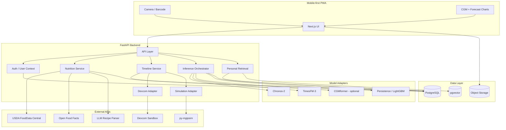

# GlycoLens Tech Stack and System Architecture

## 1. Architecture principle

Use a **modular monolith + separate model adapters**, not microservices.

Reason:
- one student
- short semester
- easier deployment/debugging
- model adapters still make forecasting components replaceable
- avoids distributed-systems overhead that does not contribute to the capstone goal

## 2. Recommended stack

| Layer | Technology | Why |
|---|---|---|
| Client | **Next.js + TypeScript** | Fast web development; PWA support; laptop + mobile |
| UI | Tailwind CSS + component library | Fast consistent UI |
| Charts | Recharts or Plotly | CGM + forecast timelines |
| Barcode | Browser barcode library (ZXing browser layer or equivalent) | Camera-based UPC/EAN capture |
| Backend | **FastAPI + Python** | Natural fit for model inference/data science |
| Validation | Pydantic | Typed API contracts |
| Data processing | Polars/Pandas + NumPy | CGM/event preprocessing |
| App DB | **PostgreSQL via Supabase** | relational data, auth ecosystem, low student cost |
| Vector retrieval | **pgvector** | similar meals in same database |
| File/object storage | Supabase Storage or local research storage | meal images/exports if needed |
| Forecast models | PyTorch/official model libraries | Chronos/TimesFM/CGM adapters |
| Nutrition | USDA FDC + Open Food Facts | structured nutrition |
| CGM integration | Dexcom OAuth 2.0 API | sandbox integration |
| Simulation | py-mgipsim | controlled virtual T1D data |
| Testing | Pytest + Playwright | backend + critical UX flows |
| Packaging | Docker | reproducible backend/model environment |

Milestone 1 pins the local development toolchains to Python 3.12.5 managed by uv and Node.js 22
managed as a pnpm workspace. Exact resolved dependencies are recorded in `uv.lock` and
`pnpm-lock.yaml`. Backend and model packages are added only alongside exercised implementation and
tests, avoiding a large speculative environment.

Milestone 1 Phase 3 adds an optional `chronos` dependency group with
`chronos-forecasting==2.3.2` and `psutil==7.2.2`. The exact `amazon/chronos-2` checkpoint revision
is pinned in the adapter. Checkpoints and benchmark records remain under ignored `artifacts/`
directories and are never application/database assets.

Milestone 1 Phase 4 adds FastAPI/Pydantic transport dependencies and a lightweight Matplotlib
research-plot dependency group. The Next.js app adds Vitest and Testing Library for executable
component and API-client behavior. The browser demonstration remains independent of model loading:
it consumes a deterministic synthetic response mapped through the canonical forecast contract.

Milestone 1 Phase 5 implements the database contract in the standard `supabase/` CLI layout. The
initial migration creates ten application tables, installs pgvector, applies integrity constraints
and indexes, and enables RLS in the same transaction. Generated local configuration and connection
details are ignored. The migration is validated locally before any hosted project is linked.

Milestone 1 Phase 6 integrates the source-only py-mgipsim repository at exact commit
`b985f8c2ea385d1b2b8480957b730866e07772f1`. Its 68 resolved packages use a separate lock and
ignored Python environment under `.cache/`. GlycoLens invokes it as an opt-in subprocess and
normalizes only relative-time simulated glucose plus aggregate metadata into ignored
`artifacts/simulation/`. It is deliberately not imported into FastAPI or persisted to Supabase in
Milestone 1; live application integration remains Milestone 2 work.

## 3. Why a PWA instead of native iOS/Android

Next.js now documents a direct PWA path supporting home-screen installation and app-like behavior without separate codebases or app-store approval.

For this capstone:
- the barcode workflow can use a mobile camera
- Dexcom OAuth works through browser redirects
- charts work well in a responsive browser
- the panel can run the app without installation
- updates are instant

If later moved to native:
- keep FastAPI/Postgres/model architecture
- replace Next.js client with React Native/Expo

## 4. High-level architecture


```mermaid
flowchart TB
    subgraph Client["Mobile-first PWA"]
      UI[Next.js UI]
      CAM[Camera / Barcode]
      CHART[CGM + Forecast Charts]
    end

    subgraph Backend["FastAPI Backend"]
      API[API Layer]
      AUTH[Auth / User Context]
      NUT[Nutrition Service]
      TL[Timeline Service]
      INF[Inference Orchestrator]
      RET[Personal Retrieval]
      SIM[Simulation Adapter]
      DEX[Dexcom Adapter]
    end

    subgraph Models["Model Adapters"]
      C2[Chronos-2]
      TF[TimesFM-3]
      CGMF[CGMformer - optional]
      BASE[Persistence / LightGBM]
    end

    subgraph Data["Data Layer"]
      PG[(PostgreSQL)]
      VEC[(pgvector)]
      OBJ[(Object Storage)]
    end

    subgraph External["External APIs"]
      USDA[USDA FoodData Central]
      OFF[Open Food Facts]
      DX[Dexcom Sandbox]
      MG[py-mgipsim]
      LLM[LLM Recipe Parser]
    end

    UI --> API
    CAM --> UI
    CHART --> UI

    API --> AUTH
    API --> NUT
    API --> TL
    API --> INF
    API --> RET

    NUT --> USDA
    NUT --> OFF
    NUT --> LLM

    TL --> PG
    RET --> PG
    RET --> VEC

    INF --> C2
    INF --> TF
    INF --> CGMF
    INF --> BASE
    INF --> PG

    DEX --> DX
    SIM --> MG
    TL --> DEX
    TL --> SIM

    AUTH --> PG
    NUT --> PG
    UI --> OBJ
```

## 5. Model adapter interface

The backend should not hard-code Chronos or TimesFM logic into routes.

Implemented interface:

```python
class ForecastModelAdapter:
    model_id: str
    model_version: str

    def load(self) -> None:
        ...

    def predict(self, request: ForecastRequest) -> ForecastResult:
        ...
```

`ForecastRequest` is the only object accepted by model code. It contains target history, past
covariates, known-at-forecast covariates, prediction length, frequency, and quantiles. It cannot
contain held-out future CGM or participant identifiers. `ForecastTarget` remains separate and is
paired with the request only inside an evaluation-only `ForecastExample`.

`ForecastResult`:

```text
model_id
model_version
context_start
context_end
forecast_timestamps[]
median[]
quantile_10[]
quantile_90[]
latency_ms
metadata
```

All values and shapes are validated before a result crosses the adapter boundary. Forecast
timestamps must be strictly future and regular; q10 <= q50 <= q90 is enforced pointwise. The
canonical contract lives under `research/models/adapters/`. The Phase 4 Pydantic transport schemas
map `ForecastResult` into relative-minute history, q10/q50/q90 bands, and 30/60/120-minute summaries
rather than duplicate inference behavior in routes or backend models.

Benefits:
- simple model swapping
- reproducible experiments
- easy research mode
- clean separation between app and model logic

## 6. Backend modules

```text
app/
├── api/
│   ├── meals.py
│   ├── forecasts.py
│   ├── timeline.py
│   ├── dexcom.py
│   └── research.py
├── services/
│   ├── nutrition/
│   ├── inference/
│   ├── retrieval/
│   ├── timeline/
│   └── simulation/
├── models/
│   ├── chronos2.py
│   ├── timesfm.py
│   ├── cgmformer.py
│   └── persistence.py
├── preprocessing/
└── db/
```

## 7. Suggested API surface

### Meal APIs
- `POST /api/meals/parse-recipe`
- `GET /api/foods/barcode/{code}`
- `POST /api/meals`
- `GET /api/meals/{id}`

### Timeline
- `GET /api/timeline?from=&to=`

### Forecast
- `GET /api/v1/forecasts/demo` - implemented M1 synthetic, identifier-free visualization contract
- `POST /api/forecast`
- `GET /api/forecast/{id}`
- `POST /api/forecast/compare-portions`

The implemented demo route never loads the Chronos checkpoint and does not accept user input. It
exists to prove the browser-to-API contract quickly and safely. Real authenticated forecast routes
remain future work and must use the same canonical adapter boundary.

### Personalization
- `GET /api/meals/{id}/similar`

### Integrations
- `GET /api/dexcom/authorize`
- `GET /api/dexcom/callback`
- `POST /api/simulation/scenario`

### Research mode
- `POST /api/research/run`
- `GET /api/research/results`

## 8. Database schema

### `users`
```text
id                # UUID; references auth.users(id)
display_name
mode              # demo / sandbox
created_at
```

### `cgm_readings`
```text
id
user_id
recorded_at       # timestamptz
glucose_mg_dl
trend
source             # dataset / dexcom / simulation
created_at
```

Indexes:
- `(user_id, timestamp)`

### `insulin_events`
```text
id
user_id
recorded_at       # timestamptz
event_type         # bolus / basal
units
source
created_at
```

### `activity_events`
```text
id
user_id
recorded_at       # timestamptz
steps
met
intensity
source
created_at
```

### `foods`
```text
id
name
barcode
source
source_food_id
serving_size
calories
carbs_g
protein_g
fat_g
fiber_g
raw_payload
created_at
```

### `meals`
```text
id
user_id
recorded_at       # timestamptz
name
meal_type
portion_multiplier
calories
carbs_g
protein_g
fat_g
fiber_g
nutrition_provenance
embedding           # pgvector
created_at
```

### `meal_items`
```text
meal_id
food_id
quantity
unit
grams
```

### `forecasts`
```text
id
user_id
meal_id
model_id
model_version
context_config
horizon_minutes
quantiles_json
latency_ms
created_at
```

### `forecast_points`
```text
forecast_id
forecast_at         # timestamptz
q10
q50
q90
```

### `meal_outcomes`
```text
meal_id
actual_30
actual_60
actual_120
trajectory_metrics_json
created_at
```

### Phase 5 authorization and migration boundary

- RLS is enabled on every exposed application table.
- `public.users` is linked to Supabase Auth, and direct ownership policies use `auth.uid()`.
- Child rows such as meal items, forecast points, and meal outcomes inherit authorization through
  their owned parent.
- Anonymous table privileges are revoked. Authenticated clients may read the shared food catalog
  but cannot write it directly.
- The embedding column uses unconstrained `vector` until the embedding model and dimension are
  selected; a vector index is therefore deferred.
- `supabase/config.toml`, endpoints, keys, and runtime state are local and ignored. Only migrations,
  pgTAP tests, and synthetic seed data are versioned.

### Phase 6 simulator boundary

- The official source commit is verified before every execution.
- The simulator dependency graph is isolated from the main application/model environment.
- Only one reviewed one-day ExtHovorka/OpenLoop scenario is supported in Milestone 1.
- Execution requires explicit opt-in and generated trajectories remain ignored local artifacts.
- Normalized output contains relative minutes, simulated glucose, meal count/total, and source
  provenance; it excludes absolute timestamps, real identifiers, and individual insulin values.
- The simulator is a demo/stress source, not formal forecast ground truth or clinical evidence.

## 9. Research data vs app database

Do not dump every raw research dataset into the production-style app database.

Recommended:

### Research pipeline
- Parquet/CSV files
- local/object storage
- Python notebooks/scripts
- event-window cache

### App database
- selected demo timelines
- app-created meals
- forecast results
- personal history

This keeps the Supabase database small and simple.

## 10. Why PostgreSQL + pgvector

The data is relational and time-indexed. A meal has a clear user, timestamp, nutrients, surrounding events and outcome.

pgvector adds:
- semantic meal similarity
- ingredient/text embeddings
- hybrid retrieval with SQL filters

A single database can therefore support:
- application transactions
- timeline queries
- personalization retrieval

Current Supabase documentation provides pgvector in Postgres, and its free tier includes a 500 MB database, which is likely sufficient for the capstone app if large research corpora remain outside the app DB.

## 11. GraphRAG decision

### Recommendation: **do not use GraphRAG in the MVP**

GraphRAG is not the right default because:
- most facts are structured numeric/time-series data
- forecasts should come from time-series models, not an LLM
- similar-meal retrieval is a nearest-neighbor problem
- an additional graph database adds development and operational burden
- graph traversal does not naturally improve the forecast target

### If used as a stretch goal

Possible graph:
```text
User
  -> ATE -> MealInstance
MealInstance
  -> CONTAINS -> Food
MealInstance
  -> PRECEDED_BY -> InsulinEvent
MealInstance
  -> HAS_OUTCOME -> GlucoseWindow
```

Neo4j AuraDB Free is currently $0 with limited node/relationship capacity, which is enough for a small capstone graph. But adding it should require a demonstrated user benefit.

## 12. Security

For the capstone:
- public de-identified datasets
- simulated patients
- Dexcom sandbox
- do not store real PHI unless explicitly approved

Secrets:
- USDA API key only server-side
- Dexcom client secret only server-side
- OAuth refresh tokens encrypted at rest if real accounts are ever used
- no secrets in Next.js client bundles

## 13. Deployment

### Recommended development/demo deployment

- Frontend: hosted PWA
- Backend: Dockerized FastAPI
- DB: Supabase
- Model inference: local/RIT machine or low-cost backend
- Demo fallback: local Docker Compose so the defense does not depend on external GPU availability

## 14. Repository and developer-tooling boundaries

The repository mirrors the modular-monolith design with separate `frontend/`, `backend/`, `research/`, `database/`, and cross-system `tests/` ownership. Repository-scoped Codex skills under `.agents/skills/` govern documentation, architecture, delivery, testing, review, measurement, and safety.

Graphify may be used locally to understand source and documentation relationships. It is a developer-only knowledge tool: it is not product GraphRAG, does not store application data, does not participate in forecasting, and does not reverse the MVP decision to use PostgreSQL and pgvector for similar-meal retrieval.

## References

- Next.js PWA: https://nextjs.org/docs/app/guides/progressive-web-apps
- Supabase pgvector: https://supabase.com/docs/guides/database/extensions/pgvector
- Supabase free tier: https://supabase.com/docs/guides/platform/billing-on-supabase
- Neo4j pricing: https://neo4j.com/pricing/
- Neo4j Free limits: https://neo4j.com/free-graph-database/
- Dexcom developer overview: https://ui-g7int-us.platform.dexcomdev.com/docs/
- USDA: https://fdc.nal.usda.gov/api-guide/
- Open Food Facts: https://openfoodfacts.github.io/documentation/docs/Product-Opener/api/
